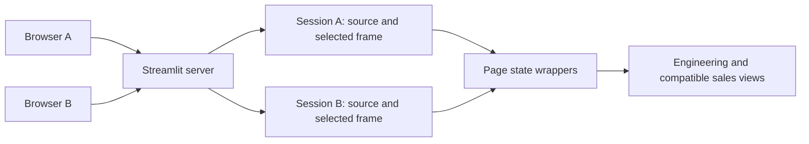
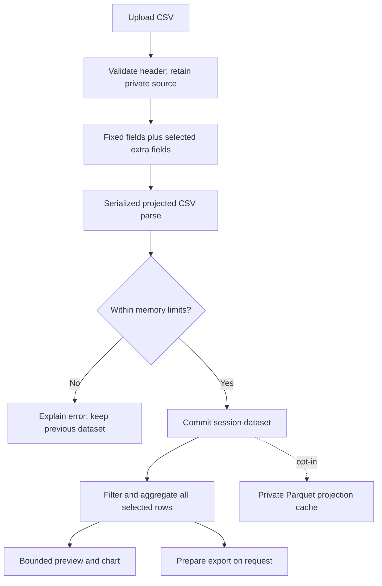

# Engineering data dashboard: service and large CSV extension

Run one Streamlit server and open it from multiple computers over a trusted LAN or VPN. Each browser tab has a separate dataset and independent page settings. The existing sales and stacked-value pages remain available, alongside a schema-independent Engineering Explorer.

## Capabilities

| Capability | Behavior |
|---|---|
| Upload | Drag a CSV from Finder/File Explorer onto the highlighted drop zone, or use its Upload button; the selected filename is shown before column selection |
| Fixed fields | All 19 fields from `synthetic_sales_data.csv`, when present |
| Extra fields | Searchable multiselect, committed with **Apply columns** |
| Data retention | Private source file and selected pandas projection per session |
| Navigation | Data, shared sales filters, and page-specific selections survive page switches |
| Engineering views | Categorical/numeric filters, grouping, aggregation, full/stacked tables, numeric/datetime trends |
| Sales pages | Existing calculations; missing-schema guidance instead of missing-column errors |
| Rendering | Generic table defaults to 200 rows; previews capped at 1,000; engineering charts capped at 10,000 points per trace |
| Export | Explicit preparation; engineering export includes all filtered rows of the selected display fields |
| Parquet | Experimental session-private cache; opt-in, automatic conversion disabled |
| Hosting | Windows service packaging and macOS foreground debug launcher |
| Administration | Opt-in loopback UI and local CLI; remote CLI through OS-authenticated SSH |

## Session administration

See [README.md: Session administration](README.md#session-administration-offline-networks-supported)
for UI instructions, local CLI and SSH examples, credential locations, exit codes and troubleshooting.

Launch with `python run_server.py --admin`; optional `--admin-port` defaults to 8502 and must
differ from the dashboard port. The administration listener runs in the same process and binds
only to `127.0.0.1`. It requires a per-launch credential protected by local OS permissions.
Without `--admin`, there is no administration listener or monitoring loop. Normal user access is unchanged.

Monitoring samples every five seconds, listing connected and retained disconnected sessions,
observed client addresses, page/dataset metadata, estimated frame/upload/export sizes, private disk
size, process RSS/CPU, and available host RAM. First-observed timestamps approximate creation;
last activity means page execution, not browser-only animation. Estimates are not hard per-session
RAM or CPU accounting. The metadata registry retains no extra DataFrames.

Termination requests cancellation on the runtime event loop, closes the selected session and
transport, prevents late ingestion commits, and releases session state and private files after its
script thread exits. Locked files are retried. Native work can delay cleanup; Python may retain freed
memory for reuse. Refresh can start a new session, including normal explicit CLI source staging.
Other sessions remain independent. Expired runtime sessions also have their tracked private files cleaned.

The adapter deliberately contains Streamlit internal API dependencies. Test administration after
dependency upgrades. The bounded audit log records session IDs and termination outcomes, not data
contents or credentials. Add `--admin` to the WinSW launcher arguments to opt in for service hosting.

Administration validation on macOS (2026-09-14, Streamlit 1.63.0): the 54-test suite passed.
Live browser sessions loaded separate sample datasets; terminating one through the CLI removed
its resources while the other retained 1,500 rows and 22 columns. Refresh created an empty session.
The authenticated console displayed session/resource metadata, and the listener was verified on
IPv4 loopback. Windows service, Windows ACL execution and remote SSH execution still require
validation on the target host.





## Installation and launch

Python 3.11 or newer. From the repository root:

```powershell
python -m venv .venv
.\.venv\Scripts\python.exe -m pip install -r requirements.txt
.\.venv\Scripts\python.exe run_server.py
```

On a MacBook:

```sh
python3 -m venv .venv
.venv/bin/python -m pip install -r requirements.txt
.venv/bin/python run_server.py --debug --sample
# OR
(.venv) python run_server.py --debug --sample
```

`--debug` enables foreground development logging. `--sample` separately exposes a **Load sample data** button; it never silently replaces an upload. Both modes use the same session isolation. `--address` defaults to `0.0.0.0`; `--port` defaults to `8501`. Open `http://SERVER_LAN_IP:8501` from clients, or `http://localhost:8501` on the host. Opening a new browser tab starts an independent session, even on the same computer.

### Start with a CSV from the command line

`run_server.py` accepts one optional CSV path. Omitting it preserves the normal behavior: each browser session starts empty and waits for a drag-and-drop or **Upload** action.

```text
python run_server.py [CSV_PATH] [--debug] [--sample] [--port PORT] [--address ADDRESS]
```

Mac/Linux examples:

```sh
# Start normally without preloading a file.
.venv/bin/python run_server.py --debug

# Stage a CSV in every new browser session.
.venv/bin/python run_server.py "/absolute/path/to/my data.csv" --debug

# Direct Streamlit launch: -- separates Streamlit options from the app argument.
.venv/bin/streamlit run "Load CSV.py" -- "/absolute/path/to/my data.csv"
```

Windows PowerShell examples:

```powershell
# Start normally without preloading a file.
.\.venv\Scripts\python.exe run_server.py

# Quote Windows paths containing spaces.
.\.venv\Scripts\python.exe run_server.py "C:\Engineering Data\my data.csv"
```

The CLI path has the following behavior:

- It must point to an existing regular file on the **server machine** and have a `.csv` extension; paths are resolved to an absolute path before Streamlit starts.
- Only one startup file is accepted. Quote paths containing spaces.
- The file goes through the same header, structure, upload-size, projection, and memory validation used for browser uploads.
- Each new browser session receives its own private copy. The original CSV is never changed or deleted by the dashboard.
- The fixed fields are selected when present. The user may select additional fields and then press **Apply columns**, just as with a dragged file.
- A later browser upload replaces the staged file only in that browser session.
- **Clear dataset** leaves the current session empty instead of immediately staging the CLI file again. A new browser session still receives the startup file.
- An invalid CLI path stops `run_server.py` with a command-line error. A CSV that fails content validation produces an in-app warning while leaving browser upload available.


To preload a file when using the Windows service, add its quoted server path after `run_server.py` in `deploy/service.xml.template` before installing the service. For example:

```xml
<arguments>"@ROOT@\run_server.py" "C:\Engineering Data\startup.csv" --port @PORT@</arguments>
```

The Windows service account must have read permission for the startup CSV. Re-run the service installation after changing the template so `deploy/EngineeringDashboard.xml` is regenerated.

### Windows service

1. Obtain the official stable WinSW **2.x** binary from [WinSW releases](https://github.com/winsw/winsw/releases), verify its origin, and place it at `deploy/EngineeringDashboard.exe`. The executable is not committed.
2. In an elevated PowerShell session, from the repository root:

```powershell
.\deploy\service.ps1 -Action install
.\deploy\service.ps1 -Action start
.\deploy\service.ps1 -Action status
# Maintenance:
.\deploy\service.ps1 -Action stop
.\deploy\service.ps1 -Action uninstall
```

Pass `-Python C:\path\to\python.exe -Port 8501` on installation to override defaults. Installation generates an XML configuration with absolute paths, automatic startup, failure restart, and rotating logs. Stop the service before upgrading dependencies. Configure a dedicated service account and a private writable data directory for production through Windows Services and its environment. WinSW's default account applies until an administrator changes it.

Allow inbound TCP 8501 only from the intended LAN/VPN range. Example, replacing the subnet with your actual client range:

```powershell
New-NetFirewallRule -DisplayName 'Engineering Dashboard LAN' -Direction Inbound -Action Allow -Protocol TCP -LocalPort 8501 -RemoteAddress 192.168.1.0/24 -Profile Domain,Private
```

The scripts do not change firewall rules, install software, or expose the server publicly automatically. This release assumes a trusted LAN/VPN and has no application login. Public-internet hosting needs a separate authenticated HTTPS deployment.

## Configuration and source rules

Set environment variables before starting the process. Service environments must be set for the service account/process, not only an interactive terminal.

| Setting | Default | Meaning |
|---|---:|---|
| `DASHBOARD_MAX_UPLOAD_MB` | 1024 | Native browser-upload and retained-source byte limit |
| `DASHBOARD_MAX_FRAME_MB` | 1024 | Deep pandas size limit for a selected projection |
| `DASHBOARD_MAX_PROCESS_MB` | 24576 | Ingestion admission/working-memory ceiling for the server process |
| `DASHBOARD_MAX_PREVIEW` | 1000 | Maximum table/grid preview rows |
| `DASHBOARD_MAX_POINTS` | 10000 | Engineering chart points per trace |
| `DASHBOARD_TTL_SECONDS` | 86400 | Idle private-source expiry |
| `DASHBOARD_DATA_DIR` | OS temp / engineering-dashboard | Private session directories |

Edit `ALWAYS_LOAD_COLUMNS` in `framework/config.py` to change the fixed list. Exact field names are preserved and matched case-sensitively. Missing fixed fields are reported and skipped. CSV input is UTF-8 (optional BOM), comma-delimited, with one nonempty, unique header row. No hierarchical-header or automatic delimiter detection is performed. Row widths and quoting are validated in one streaming pass on upload, because projected pandas reads can otherwise hide malformed extra fields.

The legacy sales date transformation is applied when Date, Revenue, Region, and Category are loaded: day-first dates, missing calendar columns derived, then Date ordering. Other engineering files retain source row order. Engineering Explorer offers explicit Original/Numeric/Datetime X interpretation, excludes invalid converted X values with a notice, and supports an X-range filter.

The source is retained privately to permit later additional-field loading. Dataset replacement is atomic after successful parsing. Failed uploads/imports leave the active frame unchanged. Applying a new projection resets dependent controls; navigating pages does not. **Clear dataset** clears the session and deletes its private files. Abandoned files expire on subsequent home-page visits; directory leases refresh on page activity. Browser refresh or server restart may lose the session; disk files are not a restore/archive feature.

Legacy widget and callback keys are namespaced per page. Shared sales filter keys use the shared utils scope. Whole-frame global legacy caches are bypassed to avoid retaining private frames across sessions; the selected frame itself is reused in session state.

## Performance and limits

Selected-column parsing avoids materializing thousands of unused columns, but CSV still requires scanning source bytes. Parsing is serialized across sessions to reduce concurrent temporary allocations. Chunks are sized by column count, and both frame size and current process RSS are checked. These are admission safeguards, not an OS hard memory limit: browser uploads, chart operations, and exports can allocate outside ingestion.

The [native Streamlit uploader buffers files in RAM](https://docs.streamlit.io/knowledge-base/using-streamlit/where-file-uploader-store-when-deleted). Thus a 500,000 × 2,000 CSV may exceed the default 1 GB upload allowance. Raise limits only after measuring real CSV size, upload concurrency, selected-frame size, and available disk/RAM. The 32 GB / five-user target is not a guarantee for arbitrary field types or selecting every field. Large exports still require temporary serialization memory.

Parquet caches selected projections only. Adding columns reads the retained CSV and produces a different projection. Cache read/write failures fall back to CSV. Automatic conversion stays disabled: enable it only after representative conversion plus three reads beats four CSV reads **and** peak memory does not increase. [Arrow supports projected Parquet reads](https://arrow.apache.org/docs/python/parquet.html); current caches already contain the selected projection.

Legacy charts retain their calculations and may be heavier than the Engineering Explorer. AgGrid previews are bounded and open the page containing the selected source row when expanding stacked mode; the Grid page control exposes the remaining rows. The enhanced legacy export retains its existing visible-grid export semantics. Engineering Explorer is the full-filtered-result export path.

## Validation

```sh
python -m pip install -r requirements-dev.txt
python -m pytest -q
# Small reproducible smoke workload:
python benchmarks/large_csv.py --rows 5000 --columns 200 --users 5
# Full opt-in workload; creates multiple multi-GB temporary CSVs:
python benchmarks/large_csv.py --rows 500000 --columns 2000 --users 5 --include-upload-buffers
```

CI runs pytest on Windows and macOS with Python 3.11. Tests cover parsing, projection, nulls, missing/duplicate headers, size limits, isolation, Parquet parity/fallback, analytical operations, legacy page rendering, widget persistence, and atomic failed replacement.

Final local smoke measurement (MacBook, 16 GB, 5 workers, 5,000 rows × 200 fields, 4 reads per worker, synthetic raw upload buffers retained):

| Loaded fields | CSV workload / peak RSS | Parquet workload / peak RSS |
|---|---:|---:|
| Fixed 19 + 20 | 5.75 s / 170.9 MiB | 1.55 s / 182.4 MiB |
| Fixed 19 + 100 | 6.32 s / 223.3 MiB | 1.75 s / 262.3 MiB |

Source size was 4,517,013 bytes; combined peak process RSS was approximately 262 MiB. These are smoke results, not a large-server capacity claim or an automatic-conversion policy. This run included synthetic upload buffers, but not the live browser/network stack. Parquet increased measured memory, so automatic conversion remains disabled. Run it on the target server and additionally exercise five concurrent browser uploads; record total server RSS and responsiveness. The full 500,000 × 2,000 workload and Windows service lifecycle have not been validated on this 16 GB MacBook.

For browser acceptance: upload distinct files with the same name in separate tabs; verify datasets/exports differ, select filters and table fields, switch pages and return, select an AgGrid row and expand stacked mode, add source columns, and attempt malformed replacement. New tabs must not inherit another tab's data.

Local verification: 40 pytest checks passed; all Python pages compiled and `git diff --check` passed. Browser checks exercised the highlighted native upload area, selected-filename feedback, cross-page dataset/field retention, a separate empty browser session, and AgGrid row selection across a stacked-mode change. Windows service execution was not exercised.
